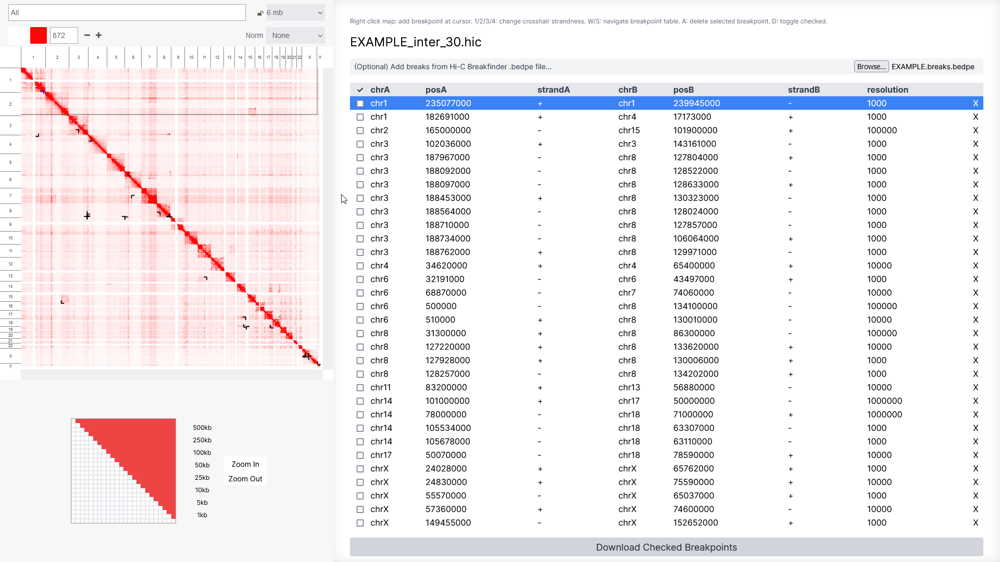

# hiccurate: An Interactive Hi-C Breakpoint Curator

This project provides an interactive application for viewing, adding, adjusting and deleting breakpoint calls from the [Arima SV Pipeline](https://github.com/ArimaGenomics/Arima-SV-Pipeline). hiccurate has been specifically designed to improve the efficiency and ergonomics of structural variant curation, and provides a strand-aware crosshair and fast navigation tools for modifying breakpoints and adjusting viewing parameters. 

This is currently a work in-progress. This project is currently only designed to work with Hi-C files in `.hic` format and breakpoints in the `hic_breakfinder`-style `.breaks.bedpe` format from the Arima SV Pipeline (v1.3). 

# Try it Out

A prototype of the application is currently hosted at [https://wjmn.github.io/static/docs/hiccurate-prototype.html](https://wjmn.github.io/static/docs/hiccurate-prototype.html). An internet connection is needed to load some of the CSS styles, but the app is otherwise completely client-side.

# Shortcuts 

| Key | Action | 
|-----|--------|
| Right click Hi-C map on left | Add breakpoint at cursor with current strandness |
| `1`, `2`, `3`, `4` |  Change crosshair strandness |
| `w` | Previous breakpoint | 
| `s` | Next breakpoint |
| `a` | Delete selected breakpoint |
| `d` | Toggle check selected breakpoint |

## Acknowledgements

The [Arima SV Pipeline](https://github.com/ArimaGenomics/Arima-SV-Pipeline) is developed by Arima Genomics. Support for the Arima SV Pipeline can be found on their GitHub page; thank you Arima for outstanding support with using the Arima SV Pipeline, and to Jon Belton at Arima for proposing the idea for a tool. 

This project is built upon the Hi-C viewer from [juicebox.js](https://github.com/igvteam/juicebox.js). 

This is currently an internal research tool developed at Snuderl Lab, NYU. 